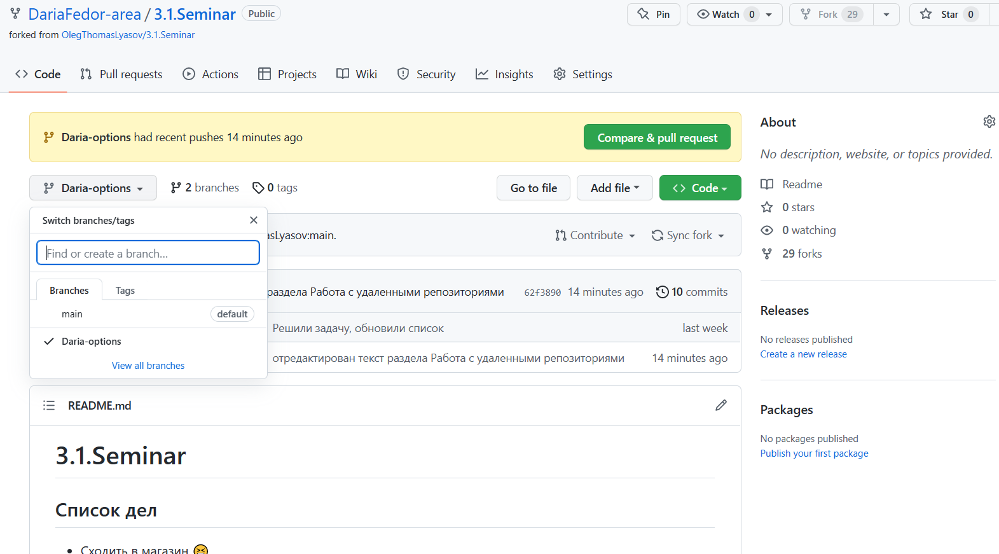

# Инструкция для работы с Markdown

## Выделение текста

Чтобы выделить тектс курсивом необходимо обрамить его звездочками (*) или нижним подчеркиванием (_). Например, *вот так* или _вот так_

Чтобы выделить текст полужирным - обрамляем двойными звездочками (**) или двойным нижним подверкиванием (__). Например, **вот так** или __вот так__

Альтернативные способы выделения текста полужирным или курсивом, чтобы мы могли совмещать оба способа. Например, _текст может быть выделен курсивом и при этом быть **полужирным**_.

## Списки

Чтобы добавить ненумерованные списки, необходимо пункты выделить звездочкой (*) или знаком плюс (+). Например, вот так:
* Элемент 1
* Элемент 2
* Элемент 3
+ Элемент 4
+ Элемент 5

Чтобы добавить нумерованные списки, необходимо пункты просто пронумеровать. Например, вот так: 
1. Первый пункт
2. Второй пункт
3. Третий пункт

## Работа с изображениями
Чтобы вставить изображение в текст, достаточно написать следующее:


## Работа с таблицами
При работе с таблицами используем вертикальный слеш (|). Для выделения шапки таблицы второй строкой необходимо использовать (--|--).

 Автоматически наименование заголовков выравнивается полевому краю. Чтобы изменить оформление вносим символы во второй сроке под ибозначением именования столбцов. 
 
 Выровнять по центру используем двоеточие (:):
 - по центру (|:---:|)
 - по правому краю (|---:)
 
№| to do | status| executor
--|-------|:-----:|----:
1| creat new start-up|in progress| Rybkin| 
2| find new staff| in progress|Gochyan
3| fix last changes in b-plan|`done`|Lehanov


## Цытаты
Для добавления цитат используем знак (>). Если хотим добавать вложеную цтату добавлем количество стрелок (>>)
> Сожалеть - лишь попусту тратить время
>> Tomas Crown (c)

## Работа с удаленными репозиториями

__*Когда создал папку с проектом на своем компьютере, и залил в онлайн(=локальный) репозиторий.*__
1. создаем папку на рабочем столе. открываем ее через vs code. проверяем наличие репо через `git status` и инициализируем папку через `git init`
2. создаем и вносим изменения, добавляем их(`git add .`) и коммитим (`git commit -m "messege"`)
3. в зарегистрированной на GitHub учетке создаем репозиторий (обязательно публичный)и сдедуем подсказкам GitHub, проделываем все необходимые команды
4. одельно обращаю внимание, при работе с уже созданным репо (когда подключаемся  есть важная команда: `git remote add origin <url>` - при наличие данной команды каждый раз когда мы будем перемещать наши изменения в онлайн репо git будет иметь адрес куда заливать данные в интернет (заливать будет через команду `git push -u origin <new_main_branch>`)
5. проделав все команды указанные в подсказке GitHub. проверяем чтобы наша папка с проектом отразилась в веб сранице репозитория.
6. далее для передачи данной папки/сдачи ДЗ/приглашения других пользователей GitHub достаточно направить ссылку на данную папку через кнопку `<> Code` копируем ссылку

__*Когда работаешь с файлом одновременно с компьютера и из онлайн (GitHub)*__
1. Внесли информацию и сделали push на онлайн репо. После зашли в репо в онлайне и на сайте внесли коррекцию, например, текста.
2. для обновления файла в локальном репо делаем команду `git pull` и затягиваем всю новую версию и коммиты в наш комп.

__*Когда хочешь внести свои предложения в чей-то проект в чужом репозитории:*__
1. для возможности работы с файлами и внесения предложений в чьем-то репозитории необходимо: склонировать данный репозиторий к себе в vs code.
2. заходим в репозиторий на сайте GitHub. Нажимаем кнопку `FORK`. 
3. Проваливаемся в необходимую папку и через кнопку `<> Code` копируем ссылку
4. возвращаемся в vs code, вводим команду `git clone <url>`. Все данные из онлайн репозитория копируются на копьютер в виде папки с вложениями. Обязательны команды: `git branch -M main` и `git push -u origin main`
5. для работы с файлами из скопированного репозитория премещаемся в клонированную папку через `cd <folder_name>`
6. содаем отдельную свою ветку, в ней проделываем всю работу. Добавляем в гит (`git add .`) Коммитим (`git commit -m "message"`). Не выходя из новой ветки делаем `git push --set-upstream origin new_branch_name`. На сайте GitHub после обновления можем увидеть, что появилась новая ветка и важная кнопка `Compare&request`
__________
## _ДОМАШНЕЕ ЗАДАНИЕ 3_
```
Дополнить файл с инструкцией по работе с git (второе домашнее задание) и направить pull request в репозиторий преподавателя.

Файл с инструкцией необходимо дополнить информацией о работе с удаленными репозиториями.В системе подгрузить скриншот отправленного pull request.[https://github.com/OlegThomasLyasov/3.1.Seminar](https://github.com/OlegThomasLyasov/3.1.Seminar)
```

_________
## *ВЫПОЛНЕНИЕ:*
1. проделала fork с репозиторием преподавателя. Создала новую ветку, внесла предложения, сделала git push, вышла на страницу с запрсом pull request 
2. отдельно выполнила ДЗ в отдельной папке: дополнила инстуркцию(версию со второй ДЗ), в новом репо со своего аккаунта залила все данные в папку. Ссылку на репо направила на сдачу преподавателю
